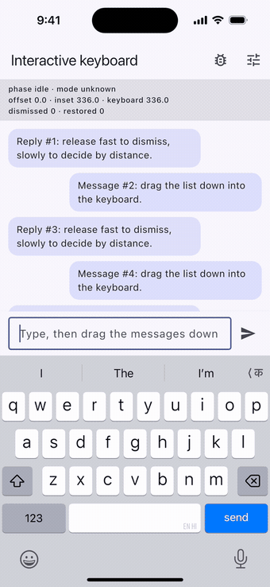

# interactive_keyboard_dismiss

Drag a Flutter scroll view down into the software keyboard and the keyboard
follows your finger. Let go and it either closes or springs back, like iOS
`UIScrollView.keyboardDismissMode = .interactive`. Works on iOS and Android
11+.

It solves [flutter/flutter#57609](https://github.com/flutter/flutter/issues/57609)
("Support for interactive keyboard dismissal") and its Android counterpart
[flutter/flutter#62876](https://github.com/flutter/flutter/issues/62876). The
only earlier package, `flutter_interactive_keyboard`, has not been updated
since 2021.



*Recorded on the iOS simulator from `example/`: the keyboard tracks the finger down, back up, and closes when the drag is carried through.*

## Install

```yaml
dependencies:
  interactive_keyboard_dismiss: ^0.1.1
```

Android: keep the default `android:windowSoftInputMode="adjustResize"` on your
activity. That is what Flutter's template uses, and the plugin needs it to
control the IME inset.

## Usage

Wrap the part of the screen that holds both the scroll view and the input bar:

```dart
import 'package:interactive_keyboard_dismiss/interactive_keyboard_dismiss.dart';

@override
Widget build(BuildContext context) {
  return InteractiveKeyboardDismiss(
    child: Scaffold(
      appBar: AppBar(title: const Text('Chat')),
      body: Column(
        children: [
          Expanded(
            child: ListView.builder(
              reverse: true,
              physics: const AlwaysScrollableScrollPhysics(),
              itemCount: messages.length,
              itemBuilder: (context, i) => MessageBubble(messages[i]),
            ),
          ),
          const ChatInputBar(),
        ],
      ),
    ),
  );
}
```

While a drag is running, `InteractiveKeyboardDismiss` passes the visible
keyboard height down as `MediaQuery.viewInsets.bottom`. The `Scaffold` in the
example therefore resizes with the keyboard and the input bar stays on its top
edge.

If you place the widget inside a `Scaffold` body, or you want to handle the
inset yourself, turn that off and read the value directly:

```dart
Scaffold(
  resizeToAvoidBottomInset: false,
  body: InteractiveKeyboardDismiss(
    adjustMediaQuery: false,
    child: Column(
      children: [
        Expanded(child: messageList),
        // Pads by the live, finger-tracked keyboard height.
        const InteractiveKeyboardPadding(child: ChatInputBar()),
      ],
    ),
  ),
);
```

`InteractiveKeyboardInset.of(context)` and `InteractiveKeyboardInsetBuilder`
return the same value. Don't combine the padding helper with a `Scaffold`
that already resizes, or the inset is applied twice.

### Options

| Parameter | Default | Meaning |
|-----------|---------|---------|
| `enabled` | `true` | Turn tracking off without rebuilding the child. |
| `controller` | own | `InteractiveKeyboardDismissController`: `keyboardOffset`, `keyboardInset`, `keyboardHeight`, `phase`, `mode`. |
| `thresholds` | 300 px/s, 0.5 | Android only. A fast downward release dismisses, a fast upward one restores, and a slow one is decided by how far the keyboard was pulled. |
| `requireScrollGesture` | `true` | Android only. Track only drags that a `Scrollable` accepted. |
| `unfocusOnDismiss` | `true` | Unfocus on dismiss. If false, the keyboard is hidden with `TextInput.hide` and focus is kept (Android only). |
| `adjustMediaQuery` | `true` | Rewrite `MediaQuery.viewInsets.bottom` for the child while a drag runs. |
| `onDismissed` / `onRestored` | – | Called when the keyboard has been dismissed or put back. |

`decideKeyboardRelease` and `keyboardOffsetForPointer` are public pure
functions, so you can unit-test your own thresholds.
`InteractiveKeyboardChannel.instance.diagnostics()` returns what the native side
sees. Attach it to bug reports.

## How it works

**iOS.** From iOS 26 the keyboard is drawn outside the app's view hierarchy.
Moving the keyboard's host view has no effect on screen (the
`UIInputSetHostView` technique), and neither does the engine's screenshot hook.
Both were tried and measured on the iOS 26 simulator. What still works is
UIKit's own behaviour. The plugin keeps a hidden `UIScrollView` with
`keyboardDismissMode = .interactive` inside the `FlutterView` and moves its pan
gesture recognizer onto the `FlutterView`. The recognizer:

- never cancels or delays Flutter's touches;
- only begins for vertical drags that start inside a registered
  `InteractiveKeyboardDismiss` widget's area;
- is switched off when no widget is on screen.

UIKit then moves the real keyboard with the finger and decides between
dismissing and restoring. The plugin reports that decision to Dart, which keeps
the layout in step.

**Android (API 30+).** The plugin uses
`WindowInsetsControllerCompat.controlWindowInsetsAnimation(ime)`, and every
finger move calls `setInsetsAndAlpha`. Flutter's engine forwards the moving
inset to `viewInsets`, so the layout follows in the same frame. On release,
the Dart thresholds pick the outcome. The native side and the Dart offset then
run the same critically damped spring and finish the controller either shown
or hidden.

## Platform support

| Platform | Behaviour |
|----------|-----------|
| iOS 13+ | Interactive, driven by UIKit. Verified on the iOS 18.6 and 26.0 simulators with real touch input. |
| Android 11+ (API 30+) | Interactive (`WindowInsetsAnimationController`). Verified on an API 36 emulator with real touch input. |
| Android 7–10 (API 24–29) | Dismisses as soon as the drag enters the keyboard. |
| Web, macOS, Windows, Linux | Pass-through: the child is rendered unchanged. |

## Limitations

- On iOS the system, not `thresholds`, decides whether the keyboard closes, the
  same as a native `UIScrollView`.
- On iOS any vertical drag that starts inside the widget's area can move the
  keyboard, not only scroll gestures.
- After an iOS dismiss UIKit hides the keyboard very quickly. The layout
  follows over the system-reported duration (about 0.25 s), so a short gap
  under the input bar can be visible.
- Floating or undocked keyboards (iPad floating keyboard, floating Android
  IMEs) are not driven.
- Some OEM IMEs may refuse `controlWindowInsetsAnimation`. The plugin then
  falls back to dismiss-on-drag.
- The Android < 30 fallback and physical devices have not been tested by the
  author yet (only simulators and emulators). Please report device-specific
  issues with the output of `diagnostics()`.

## Links

- **Documentation:** [flutterdev.in/packages/interactive_keyboard_dismiss](https://flutterdev.in/packages/interactive_keyboard_dismiss/)
- **More Flutter packages:** [flutterdev.in](https://flutterdev.in)
- **Learn data structures & algorithms in Dart:** [Algoistan](https://algoistan.flutterdev.in)

## License

MIT © 2026 Manish Kumar Panday
